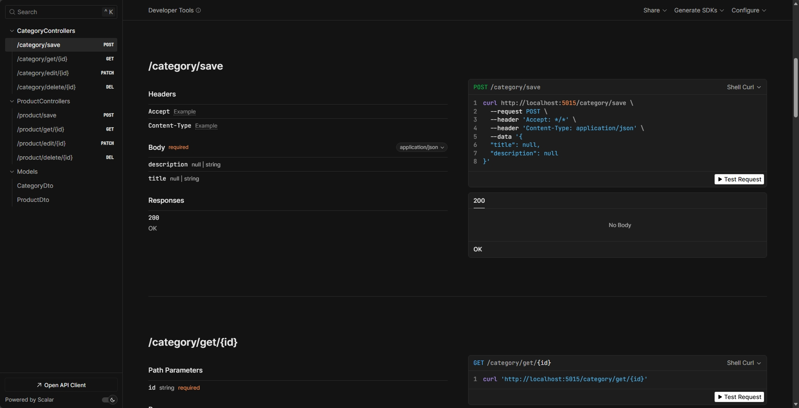

# Catalog Manager API




## Descrição

Este repositório contém uma API RESTful em ASP.NET criada como parte de um desafio de back-end inspirado no challenge do GitHubAnotaAi [(new-test-backend-nodejs)](https://github.com/githubanotaai/new-test-backend-nodejs). A proposta é desenvolver um sistema completo para gerenciamento de produtos e categorias, aplicando princípios sólidos de arquitetura, organização e legibilidade de código.

A API foi projetada para oferecer operações de CRUD (Create, Read, Update, Delete) tanto para produtos quanto para categorias, com ênfase em uma estrutura de código bem organizada, fácil de manter e escalável. Boas práticas como separação de responsabilidades, uso adequado de camadas e clareza nas rotas foram consideradas ao longo do desenvolvimento.

## Tecnologias

- C# .NET 10
- ASP.NET Core
- MongoDB
- Docker (opcional)

## Estrutura 

```text
src
├── Program.cs
│
├── Application
│   ├── Dtos
│   │   ├── CategoryDtos.cs
│   │   └── ProductDtos.cs
│   │
│   ├── Ports
│   │   └── IPortsGenericRepo.cs
│   │
│   └── UseCases
│       ├── CategoryUseCases.cs
│       └── ProductUseCases.cs
│
├── Domain
│   └── Entities
│       ├── Category.cs
│       └── Product.cs
│
└── Infrastructure
    ├── Http
    │   └── Controllers
    │       ├── CategoryController.cs
    │       └── ProductController.cs
    │
    ├── Middlewares
    │   └── GlobalErrorHandler.cs
    │
    └── Persistence
        └── MongoDb
            ├── MongoDbInjection.cs
            ├── MongoDbSettings.cs
            │
            ├── Documents
            │   ├── CategoryDoc.cs
            │   └── ProductDoc.cs
            │
            └── Repository
                ├── CategoryRepo.cs
                └── ProductRepo.cs

```

## Instalação e execução

### Pre Requesitos
- .NET SDK 10.0+
- MongoDb (Local ou Docker)
- Git

```bash
# Clone repository
git clone https://github.com/DAN-3200/dotnet-catalog-manager.git
cd dotnet-catalog-manager/main

# Configure MongoDB in appsettings.json
"MongoDbSettings": {
    "ConnectionString": "mongodb://localhost:27017",
    "DatabaseName": "ProductCatalogDb"
}

# Run application
dotnet run --project .
```

## Documentação

Documentação disponível a partir do Scalar UI [http://localhost:5015/scalar/v1](http://localhost:5015/scalar/v1)

## Licença

Este projeto está licenciado sob a Licença MIT. Consulte o arquivo [LICENSE](./LICENSE) para mais detalhes.
